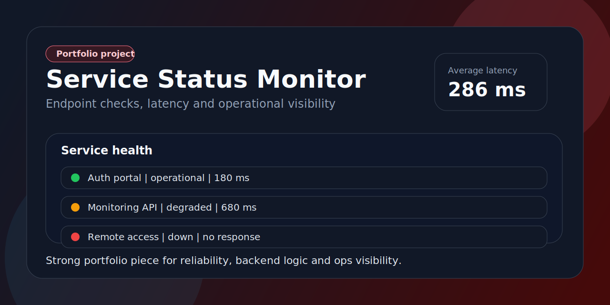

<p align="center">
  
</p>

<h1 align="center">Service Status Monitor</h1>

<p align="center">
  Monitor simples de servicos com checagem manual de endpoints, latencia e status operacional.
</p>

<p align="center">
  
  
  
  
</p>

## Problema que resolve

Quando uma API ou servico cai, times pequenos precisam de uma forma rapida de validar status, latencia e dono do incidente. Este projeto entrega uma base leve para observabilidade operacional.

## O que o app entrega

- cards de saude operacional por endpoint
- checagem manual via API route
- leitura de status, latencia e horario da ultima verificacao
- suporte a demo data e integracao opcional com Supabase

## Stack

- Next.js 15
- TypeScript
- Supabase
- CSS global customizado
- GitHub Actions

## Como rodar

```bash
npm install
cp .env.example .env.local
npm run dev
```

Variavel extra opcional:

```env
MONITOR_TIMEOUT_MS=4000
```

## Arquivos importantes

- `app/page.tsx`: painel de status
- `app/api/check/route.ts`: checagem manual do endpoint
- `components/status-checker.tsx`: interface para rodar validacoes
- `supabase/schema.sql`: estrutura base do monitor

## O que este projeto demonstra

- entendimento de observabilidade e confiabilidade
- uso de API route para logica server-side simples
- clareza para exibir status operacional
- portfolio com cara de software util e monitoravel
